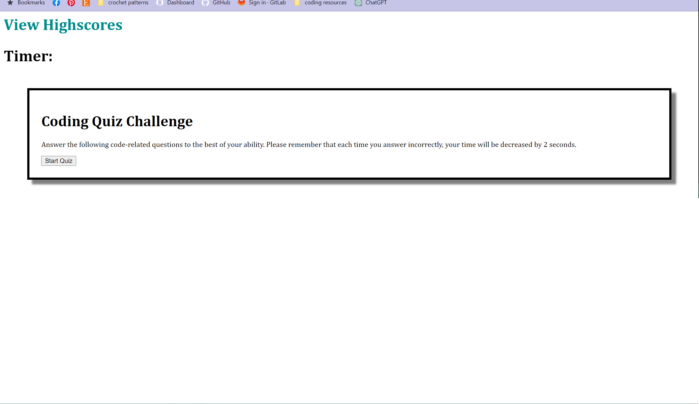
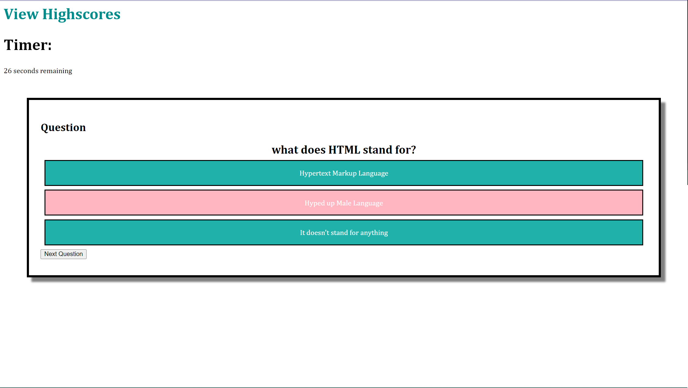

# Module-4-timed-quiz-app

## Description:
    This app allows you to take a timed quiz about coding. 

## Table of Contents:
* [Installation](#installation)
* [Usage](#usage)
* [Credits](#credits)
* [License](#license)

## Installation
n/a

## Usage
Open the app in a browser. From there you can click the start quiz button, which will start the 30 second timer and display the first question. When you click the answer you get a "right" or "wrong" message, and your points will increase or stay the same. You may also click on the highscores link to go to the high scores page. 

In the future, time will be deducted for incorrect answers and you will be able to view the high scores on the high score page. 

## Credits

## License  

## Tests

## Questions

github repo:
https://github.com/jensandage1/Module-4-timed-quiz-app

